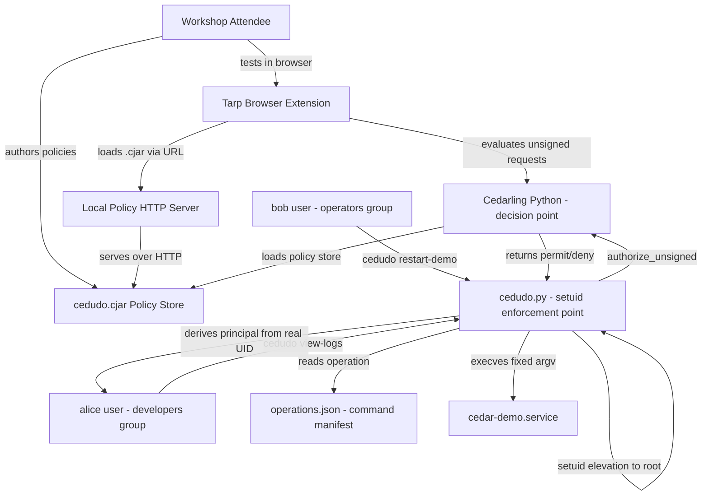
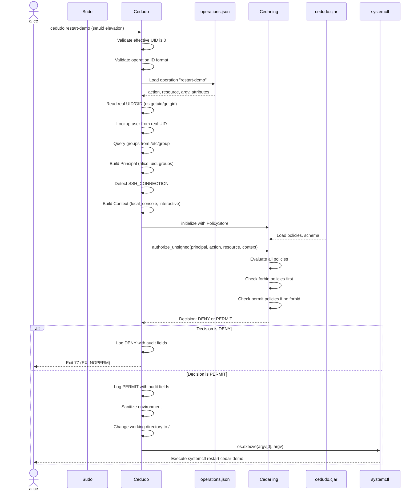

# Design Document: Cedar Privilege Authorization Workshop

## Overview

The Cedar Privilege Authorization Workshop is an 80-minute hands-on educational experience teaching attendees how to use Cedar authorization policies to control privileged Linux operations. The system demonstrates a critical security architecture pattern: the separation of **policy decision** and **policy enforcement**.

### Core Concept

This workshop builds a Cedar-based authorization architecture where:

1. **cedudo** (setuid-root executable) performs privilege transition and policy enforcement
2. **Cedarling** (Policy Decision Point) evaluates Cedar policies and returns permit/deny decisions
3. **Tarp** (browser-based policy workbench) allows testing policies before deployment
4. A shared **`.cjar` policy store** is consumed by both Tarp and cedudo

This separation ensures that authorization logic is decoupled from privilege mechanics, making policies testable, auditable, and maintainable independently of the enforcement infrastructure.

### Educational Scope

This is explicitly an **educational implementation, not production-ready**. Production use would require:
- Compiled root-owned enforcement binary (not Python script) - this workshop uses a minimal C wrapper to enable setuid on the Python script
- Signed and versioned policy stores with rollback protection
- JWT-based workload authentication instead of application-asserted identity
- Formal security review of all operation-to-command bindings
- Policy tamper protection and secure decision logging
- Environment sanitization and stronger session authentication

### Workshop Outcomes

By completing the workshop, attendees will:
- Model Linux privileges as Cedar PARC (Principal, Action, Resource, Context) requests
- Test authorization decisions in Tarp before deploying to enforcement
- Modify Cedar policies and observe behavior changes in real privileged operations
- Understand how fixed command manifests prevent argument injection attacks
- Recognize the security benefits of separating decision, enforcement, and privilege escalation
- Add contextual controls (local vs remote, critical resources, group requirements)


## Architecture

### System Components



### Component Responsibilities

| Component | Responsibility | Trust Boundary |
|-----------|---------------|----------------|
| **cedudo (C wrapper + Python)** | Policy Enforcement Point - privilege transition via setuid wrapper, validates operations, constructs PARC request, enforces decision | Setuid-root compiled wrapper, kernel enforced |
| **Cedarling** | Policy Decision Point - evaluates Cedar policies against request | Embedded library in cedudo |
| **operations.json** | Operation manifest - binds operation IDs to fixed command arrays | Root-owned, immutable |
| **cedudo.cjar** | Policy store - contains Cedar policies, schema, entities | Root-owned, deployed atomically |
| **Tarp** | Policy workbench - tests policies with unsigned authorization | User browser, no privilege |
| **Policy Server** | HTTP server - serves .cjar to Tarp with CORS | User process, no privilege |


### Authorization Flow

The complete authorization and execution flow:




### Trust and Security Boundaries

The architecture establishes several critical trust boundaries:

1. **Kernel Trust Boundary**: Only the setuid mechanism can perform privilege escalation. The kernel enforces that the compiled `/opt/cedudo/cedudo` wrapper runs with root privileges while preserving the real UID for identity tracking. Modern Linux kernels ignore setuid bits on interpreted scripts, so a C wrapper is required.

2. **Root Ownership Boundary**: All enforcement-critical files are root-owned with restrictive permissions:
   - `/opt/cedudo/cedudo` (4755 root:root) - setuid C wrapper binary
   - `/opt/cedudo/cedudo.py` (0644 root:root) - Python enforcement script
   - `/opt/cedudo/operations.json` (0644 root:root) - command manifest
   - `/opt/cedudo/cedudo.cjar` (0644 root:root) - policy store

3. **Input Validation Boundary**: cedudo accepts only a single operation ID matching `[a-z][a-z0-9-]{0,63}`. All other parameters (principal, action, resource, context, argv) are derived from trusted sources.

4. **Policy Decision Boundary**: Cedarling evaluates policies in isolation. It receives structured PARC requests and returns boolean decisions without side effects.

5. **Command Execution Boundary**: After authorization, cedudo executes only the exact `argv` array from the root-owned manifest. No shell interpretation, no user-supplied arguments, no command substitution.

This layered defense ensures that:
- Users cannot bypass Cedar authorization to run privileged commands
- Users cannot inject arguments into authorized commands
- Users cannot tamper with policies, manifests, or enforcement logic
- Authorization decisions are auditable and repeatable
- Policy testing (Tarp) uses the same policy store as enforcement (cedudo)


## Components and Interfaces

### cedudo.py - Policy Enforcement Point

**Purpose**: Root-owned Python script that validates operations, constructs Cedar authorization requests from trusted sources, enforces decisions, and executes fixed privileged commands.

**Note**: This Python script cannot directly use setuid on modern Linux systems. It is executed through a C wrapper (see next section).

**Interface**:
```bash
cedudo <operation-id>
```

**Input Validation**:
- Operation ID must match regex: `^[a-z][a-z0-9-]{0,63}$`
- No additional arguments accepted
- Validates effective UID is 0 (root) - setuid bit must be set
- Validates real UID is not 0 (not direct root execution)

**Principal Construction**:
```python
# Derive from trusted OS sources (setuid preserves real UID)
uid = os.getuid()  # Real UID of invoking user
gid = os.getgid()  # Real GID of invoking user

# Validate against system database
account = pwd.getpwuid(uid)
assert account.pw_uid == uid and account.pw_gid == gid

# Query real group memberships
group_ids = os.getgrouplist(account.pw_name, account.pw_gid)
groups = sorted({grp.getgrgid(gid).gr_name for gid in group_ids})

# Construct Cedar principal entity
principal = EntityData(
    cedar_entity_mapping=CedarEntityMapping(
        entity_type="Linux::User",
        id=username
    ),
    uid=uid,
    gid=gid,
    groups=groups,
    home=account.pw_dir,
    shell=account.pw_shell
)
```

**Context Derivation**:
```python
def is_remote_session():
    # Check environment variables
    if os.environ.get("SSH_CONNECTION") or os.environ.get("SSH_CLIENT"):
        return True
    # Check process ancestry for sshd
    if "sshd" in ancestor_names(os.getppid()):
        return True
    return False

context = {
    "current_time": int(time.time()),
    "hostname": socket.gethostname(),
    "local_console": not is_remote_session(),
    "interactive": os.isatty(0) and os.isatty(1)
}
```


**Cedarling Integration**:
```python
# Initialize with root-owned policy store
os.environ["CEDARLING_POLICY_STORE_LOCAL_FN"] = "/opt/cedudo/cedudo.cjar"
os.environ["CEDARLING_APPLICATION_NAME"] = "cedudo"

config = BootstrapConfig.from_env()
cedarling = Cedarling(config)

# Build unsigned authorization request
request = RequestUnsigned(
    principal=principal,
    action=operation["action"],  # e.g., "Linux::Action::\"Restart\""
    resource=resource,
    context=context
)

# Evaluate and enforce
result = cedarling.authorize_unsigned(request)
allowed = result.is_allowed()
```

**Command Execution**:
```python
if not allowed:
    LOG.warning("DENY user=%s operation=%s", username, operation_id)
    raise SystemExit(77)  # EX_NOPERM

# Sanitize environment
safe_env = {
    "PATH": "/usr/sbin:/usr/bin:/sbin:/bin",
    "HOME": "/root",
    "USER": "root",
    "LOGNAME": "root",
    "LANG": "C.UTF-8",
    "TERM": "dumb",
    "PAGER": "cat",
    "SYSTEMD_PAGER": "cat"
}

# Execute with fixed argv, no shell
LOG.info("PERMIT user=%s operation=%s exec=%r", username, operation_id, argv)
os.chdir("/")
os.execve(argv[0], argv, safe_env)
```

**Fail-Closed Behavior**:
- Any error during initialization → exit without execution
- Unknown operation ID → exit without execution
- Cannot resolve user from real UID → exit without execution
- Cannot resolve user/groups → exit without execution
- Cedarling initialization failure → exit without execution
- Authorization evaluation exception → exit without execution
- Authorization deny → exit without execution


### cedudo (C Wrapper) - Setuid Enabler

**Purpose**: Compiled binary that enables setuid functionality for the Python enforcement script.

**Why Needed**: Modern Linux kernels ignore the setuid bit on interpreted scripts (files with `#!/usr/bin/python3` shebangs) for security reasons. A compiled binary is required to use setuid.

**Implementation** (cedudo-wrapper.c):
```c
#include <unistd.h>
#include <stdio.h>

#define PYTHON_PATH "/opt/cedudo/venv/bin/python3"
#define SCRIPT_PATH "/opt/cedudo/cedudo.py"

int main(int argc, char *argv[]) {
    char *python_args[argc + 2];
    
    python_args[0] = PYTHON_PATH;
    python_args[1] = SCRIPT_PATH;
    
    for (int i = 1; i < argc; i++) {
        python_args[i + 1] = argv[i];
    }
    
    python_args[argc + 1] = NULL;
    
    execv(python_args[0], python_args);
    perror("cedudo-wrapper: execv failed");
    return 1;
}
```

**Build and Installation**:
```bash
gcc -o cedudo-wrapper cedudo-wrapper.c
sudo cp cedudo-wrapper /opt/cedudo/cedudo
sudo chown root:root /opt/cedudo/cedudo
sudo chmod 4755 /opt/cedudo/cedudo
sudo ln -sf /opt/cedudo/cedudo /usr/local/bin/cedudo
```

Or use the provided installation script:
```bash
./install-wrapper.sh
```

**Security Properties**:
- Compiled binary CAN use setuid (kernel allows it)
- Executes Python interpreter with elevated privileges
- Python script inherits root effective UID
- Real UID remains the invoking user's UID
- Wrapper has minimal attack surface (30 lines of C)
- No dynamic library dependencies beyond libc
- Fixed paths prevent path injection


### operations.json - Command Manifest

**Purpose**: Root-owned JSON manifest that binds operation IDs to fixed command arrays, preventing argument injection and command substitution.

**Structure**:
```json
{
  "view-logs": {
    "action": "Linux::Action::\"ReadLogs\"",
    "resource_type": "Linux::Service",
    "resource_id": "cedar-demo",
    "resource_attributes": {
      "environment": "workshop",
      "critical": false
    },
    "argv": [
      "/usr/bin/journalctl",
      "-u",
      "cedar-demo",
      "-n",
      "20",
      "--no-pager"
    ]
  },
  "restart-demo": {
    "action": "Linux::Action::\"Restart\"",
    "resource_type": "Linux::Service",
    "resource_id": "cedar-demo",
    "resource_attributes": {
      "environment": "workshop",
      "critical": false
    },
    "argv": [
      "/usr/bin/systemctl",
      "restart",
      "cedar-demo"
    ]
  }
}
```

**Validation Rules**:
1. File must be regular file (not symlink), root-owned, not group/world writable
2. Each operation must have: `action`, `resource_type`, `resource_id`, `argv`
3. `argv` must be non-empty array of strings with no null bytes
4. `argv[0]` must be absolute path to executable
5. Executable must exist, be root-owned, not group/world writable, and have execute permission
6. `resource_attributes` optional, defaults to empty object if not provided

**Security Properties**:
- Operation IDs are semantic names (view-logs, restart-demo), not command strings
- All command arguments are fixed at manifest creation time
- No user-supplied values appear in executed commands
- Manifest is validated before any authorization evaluation
- Executables are resolved and validated before execution


### Cedar Policy Store (cedudo.cjar)

**Purpose**: Compiled Cedar archive containing policies, schema, and entity definitions, consumed by both Tarp (for testing) and Cedarling (for enforcement).

**Contents**:
- **Policies**: Cedar authorization rules in compiled format
- **Schema**: Entity type definitions (Linux::User, Linux::Service, Linux::Host, Linux::Action)
- **Entities**: Static entity definitions if needed

**Starter Policies**:

```cedar
// Policy 1: Developers and operators can read logs
permit (
    principal,
    action == Linux::Action::"ReadLogs",
    resource == Linux::Service::"cedar-demo"
)
when {
    principal.groups.contains("developers") ||
    principal.groups.contains("operators")
};

// Policy 2: Operators can restart locally
permit (
    principal,
    action == Linux::Action::"Restart",
    resource == Linux::Service::"cedar-demo"
)
when {
    principal.groups.contains("operators") &&
    context.local_console
};

// Policy 3: Forbid root shells (invariant)
forbid (
    principal,
    action == Linux::Action::"OpenShell",
    resource
);
```

**Schema Definition**:
```json
{
  "Linux": {
    "entityTypes": {
      "User": {
        "shape": {
          "type": "Record",
          "attributes": {
            "uid": {"type": "Long"},
            "gid": {"type": "Long"},
            "groups": {"type": "Set", "element": {"type": "String"}},
            "home": {"type": "String"},
            "shell": {"type": "String"}
          }
        }
      },
      "Service": {
        "shape": {
          "type": "Record",
          "attributes": {
            "environment": {"type": "String"},
            "critical": {"type": "Boolean"}
          }
        }
      },
      "Host": {
        "shape": {
          "type": "Record",
          "attributes": {}
        }
      }
    },
    "actions": {
      "ReadLogs": {},
      "ViewStatus": {},
      "Restart": {},
      "OpenShell": {}
    }
  }
}
```


**Build and Deployment Workflow**:

```bash
# 1. Author policies in ~/cedudo-workshop/policy/cedar-policy.cedar
# 2. Define schema in ~/cedudo-workshop/policy/cedar-schema.json
# 3. Build .cjar archive
cd ~/cedudo-workshop
./tools/build-cjar.sh
# Compiles policies + schema → policy/cedudo.cjar

# 4. Test in Tarp (loads from http://127.0.0.1:8000/cedudo.cjar)
# 5. Deploy to enforcement
sudo ./tools/deploy-policy.sh
# Validates + copies to /opt/cedudo/cedudo.cjar with root ownership
```

**File Permissions**:
- `/opt/cedudo/cedudo.cjar`: 0644 root:root
- `~/cedudo-workshop/policy/cedudo.cjar`: 0644 user:user

### Tarp Policy Workbench

**Purpose**: Browser extension that loads Cedar policies and evaluates unsigned authorization requests for testing without deployment.

**Configuration**:
- Policy Store URL: `http://127.0.0.1:8000/cedudo.cjar`
- Authorization Mode: Unsigned (application constructs principal)
- CORS: Required from local policy server

**Example Unsigned Request** (alice-restart.json):
```json
{
  "principal": {
    "cedar_entity_mapping": {
      "entity_type": "Linux::User",
      "id": "alice"
    },
    "uid": 1000,
    "gid": 1000,
    "groups": ["developers"],
    "home": "/home/alice",
    "shell": "/bin/bash"
  },
  "action": "Linux::Action::\"Restart\"",
  "resource": {
    "cedar_entity_mapping": {
      "entity_type": "Linux::Service",
      "id": "cedar-demo"
    },
    "environment": "workshop",
    "critical": false
  },
  "context": {
    "local_console": true,
    "interactive": true,
    "current_time": 1700000000,
    "hostname": "workshop-vm"
  }
}
```

**Workflow**:
1. Start local policy server: `cd ~/cedudo-workshop/policy && python3 ../tools/serve-policy.py`
2. Open Tarp in browser, configure policy URL
3. Load example request JSON
4. Observe permit/deny decision
5. Modify policy, rebuild .cjar, reload in Tarp
6. Verify expected decision change
7. Deploy to `/opt/cedudo/` when satisfied


### Local Policy HTTP Server

**Purpose**: Simple Python HTTP server with CORS enabled to serve `.cjar` files to Tarp.

**Implementation** (tools/serve-policy.py):
```python
#!/usr/bin/env python3
import http.server
import socketserver
from pathlib import Path

class CORSRequestHandler(http.server.SimpleHTTPRequestHandler):
    def end_headers(self):
        self.send_header('Access-Control-Allow-Origin', '*')
        self.send_header('Access-Control-Allow-Methods', 'GET, OPTIONS')
        self.send_header('Access-Control-Allow-Headers', 'Content-Type')
        super().end_headers()
    
    def do_OPTIONS(self):
        self.send_response(200)
        self.end_headers()

PORT = 8000
with socketserver.TCPServer(("127.0.0.1", PORT), CORSRequestHandler) as httpd:
    print(f"Serving policy store at http://127.0.0.1:{PORT}/")
    print("Configure Tarp to load: http://127.0.0.1:8000/cedudo.cjar")
    httpd.serve_forever()
```

**Usage**:
```bash
cd ~/cedudo-workshop/policy
python3 ../tools/serve-policy.py
# Serves cedudo.cjar with CORS on http://127.0.0.1:8000/
```

### Demo Service (cedar-demo.service)

**Purpose**: Harmless systemd service for safe privilege operation demonstrations.

**Implementation**:
```ini
[Unit]
Description=Cedar Workshop Demo Service
After=network.target

[Service]
Type=simple
User=nobody
ExecStart=/usr/local/bin/cedar-demo-service.sh
Restart=always
RestartSec=5

[Install]
WantedBy=multi-user.target
```

**Service Script** (/usr/local/bin/cedar-demo-service.sh):
```bash
#!/bin/bash
while true; do
    echo "Cedar demo service running at $(date)"
    sleep 30
done
```

**Properties**:
- Runs as unprivileged user (nobody)
- No network dependencies
- No persistent state
- Safe to restart repeatedly
- Writes timestamps to journal
- No data loss on restart


## Data Models

### Cedar PARC Request Structure

Cedar authorization requests follow the PARC model, as documented in the [Cedar Policy Language Reference](https://docs.cedarpolicy.com/auth/authorization.html). Content rephrased for compliance with licensing restrictions.

#### Principal (P)

Represents the authenticated entity making the authorization request:

```python
{
  "cedar_entity_mapping": {
    "entity_type": "Linux::User",
    "id": "alice"  # Derived from real UID lookup
  },
  "uid": 1000,     # Derived from os.getuid() (real UID)
  "gid": 1000,     # Derived from os.getgid() (real GID)
  "groups": ["developers"],  # Queried from os.getgrouplist()
  "home": "/home/alice",     # From pwd.getpwuid()
  "shell": "/bin/bash"       # From pwd.getpwuid()
}
```

**Derivation**:
- Identity comes from real UID/GID (preserved by setuid mechanism)
- Group memberships queried from system databases
- Cannot be supplied by user via command-line arguments
- Validated against system user database

#### Action (A)

Represents the privileged capability being requested:

```
Linux::Action::"ReadLogs"
Linux::Action::"ViewStatus"
Linux::Action::"Restart"
Linux::Action::"OpenShell"
```

**Derivation**:
- Mapped from operation ID via operations.json manifest
- Fixed at manifest creation time
- Cannot be modified by user at request time

#### Resource (R)

Represents the Linux entity being operated upon:

```python
{
  "cedar_entity_mapping": {
    "entity_type": "Linux::Service",
    "id": "cedar-demo"  # From operations.json
  },
  "environment": "workshop",  # From operations.json resource_attributes
  "critical": false           # From operations.json resource_attributes
}
```

**Derivation**:
- Entity type and ID from operations.json manifest
- Attributes from operations.json resource_attributes
- Cannot be modified by user at request time


#### Context (C)

Represents point-in-time request conditions:

```python
{
  "current_time": 1700000000,     # Unix timestamp from time.time()
  "hostname": "workshop-vm",       # From socket.gethostname()
  "local_console": true,           # Derived from SSH detection
  "interactive": true              # From os.isatty() checks
}
```

**Derivation**:
- `local_console`: false if SSH_CONNECTION, SSH_CLIENT, or sshd in process ancestry
- `interactive`: true if stdin and stdout are both TTYs
- Cannot be supplied by user via command-line arguments

### Cedar Policy Evaluation Semantics

As documented in the [Cedar authorization model](https://docs.cedarpolicy.com/auth/authorization.html), Cedar follows these evaluation rules (content rephrased for compliance):

1. **Default Deny**: If no policies match a request, the result is DENY
2. **Forbid Overrides Permit**: If any forbid policy matches, the result is DENY regardless of permit policies
3. **Explicit Permit Required**: At least one permit policy must match for ALLOW result

**Evaluation Algorithm**:
```
1. Collect all policies matching request scope
2. Evaluate each policy's when/unless conditions
3. If any forbid evaluates to true → DENY
4. Else if any permit evaluates to true → ALLOW
5. Else → DENY (default)
```

**Policy Structure**:
```cedar
<effect> (
    principal,        // Scope: which principals
    action,          // Scope: which actions
    resource         // Scope: which resources
)
when {
    <boolean conditions>  // Conditions using principal, resource, context
}
unless {
    <boolean conditions>  // Negative conditions
};
```


### File Structure and Permissions

```
/opt/cedudo/                           # Root-owned enforcement directory
├── cedudo             (4755 root:root)  # Setuid C wrapper binary
├── cedudo.py          (0644 root:root)  # Python enforcement script
├── operations.json    (0644 root:root)  # Command manifest
├── cedudo.cjar        (0644 root:root)  # Policy store
└── venv/                                # Python virtual environment
    └── bin/python3                      # With cedarling-python

/usr/local/bin/cedudo                  # Symlink to /opt/cedudo/cedudo

~/cedudo-workshop/                     # User-owned workshop directory
├── policy/
│   ├── cedar-policy.cedar             # Editable Cedar policies
│   ├── cedar-schema.json              # Schema definition
│   └── cedudo.cjar                    # Built policy store (for testing)
├── examples/
│   ├── alice-read-logs.json           # Example unsigned requests
│   ├── alice-restart.json
│   └── bob-restart.json
├── tools/
│   ├── build-cjar.sh                  # Compile policies to .cjar
│   ├── serve-policy.py                # Local HTTP server for Tarp
│   └── deploy-policy.sh               # Deploy to /opt/cedudo/
├── cedudo-wrapper.c                   # C wrapper source
├── install-wrapper.sh                 # Build and install wrapper
└── README.md                          # Workshop documentation
```

### Audit Log Format

**Permit Decision**:
```
cedudo[12345]: INFO PERMIT user=alice uid=1000 operation=restart-demo action=Linux::Action::"Restart" resource=Linux::Service::cedar-demo local_console=true exec=['/usr/bin/systemctl', 'restart', 'cedar-demo']
```

**Deny Decision**:
```
cedudo[12345]: WARNING DENY user=alice uid=1000 operation=restart-demo action=Linux::Action::"Restart" resource=Linux::Service::cedar-demo local_console=false
```

**Log Destinations**:
- stderr: Always (visible to user)
- syslog (/dev/log): When available (system audit trail)

**Audit Fields**:
- user: Original username from real UID lookup
- uid: Original user ID from os.getuid()
- operation: Operation ID from command line
- action: Cedar action from operations.json
- resource: Cedar resource type::id
- local_console: Boolean context flag
- exec: Full argv array (permit only)

